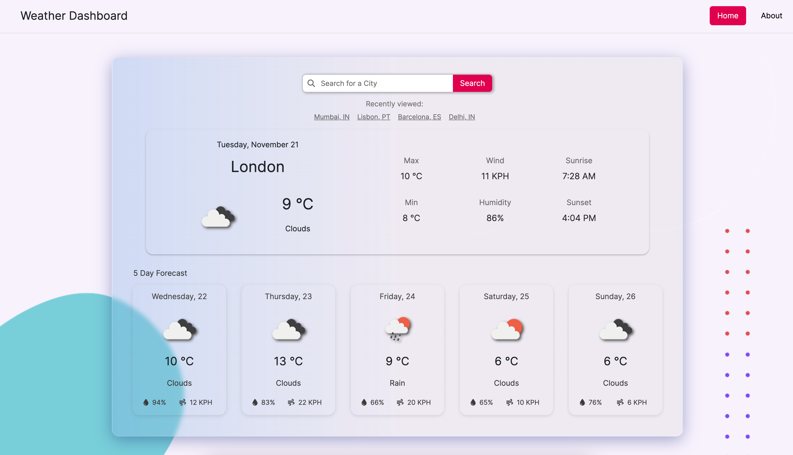
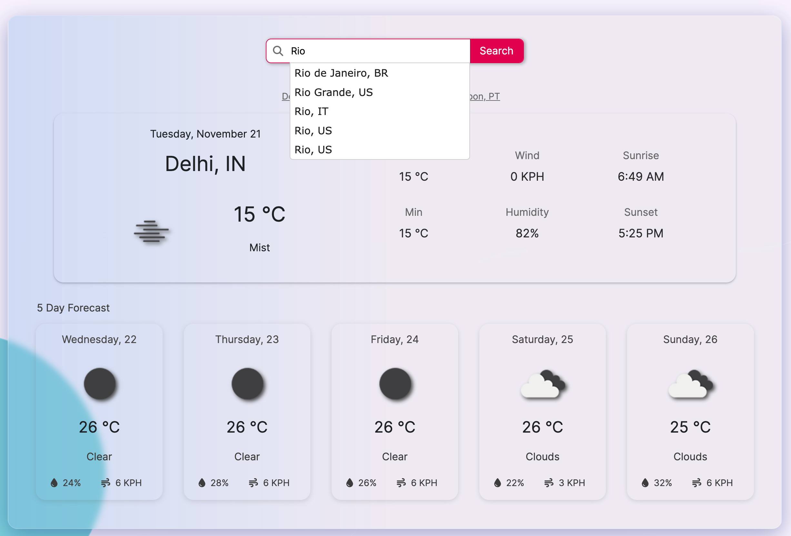

# Weather-Forecast-Dashboard
A weather dashboard that shows the current weather status for the searched city and displays 5-day forecast.

- **Visit** the application at: https://gsgghotra.github.io/Weather-Forecast-Dashboard/

## Table of Contents

1. [Introduction](#introduction)
2. [Screenshots](#screenshots)
3. [Contact Information](#contact-information)

## Introduction

* A weather dashboard with form inputs.
  * When a user searches for a city they are presented with current and future conditions for that city and that city is added to the search history.
  * The search bar uses auto complition tool to prevent human errors.

  * When a user views the current weather conditions for that city they are presented with:
    * The city name
    * The date
    * An icon representation of weather conditions
    * The temperature
    * The humidity
    * The wind speed

* When a user view future weather conditions for that city they are presented with a 5-day forecast that displays:
    * The date
    * An icon representation of weather conditions
    * The temperature
    * The humidity
  * When a user click on a city in the search history they are again presented with current and future conditions for that city

- **Technologies Used**: HTML, CSS, Bootstrap, JavaScript, jQuery

## Screenshots
- **Home Screen**:

- **Search History**:

- **Auto complition**:

## Contact Information

- **Email**: gsgghotra@gmail.com
- **LinkedIn**: [gsgghotra](https://www.linkedin.com/in/gsgghotra/)